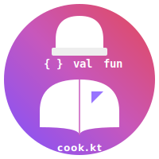

  
# Kotlin CookBook 🍳

[](https://github.com/realmg51-cpu/KotlinCookBook/releases)
[](https://github.com/realmg51-cpu/KotlinCookBook/actions/workflows/docker-ci.yml)

[](LICENSE)


> *"Learn Kotlin the fun way – one recipe at a time!"*

## 🔗 Quick Links

[📖 Read Online](https://github.com/realmg51-cpu/KotlinCookBook) |
[🐛 Report Bug](https://github.com/realmg51-cpu/KotlinCookBook/issues) |
[✨ Request Recipe](https://github.com/realmg51-cpu/KotlinCookBook/issues) |
[🐳 Docker Hub](https://github.com/realmg51-cpu/KotlinCookBook/pkgs/container/kotlincookbook) |
[📚 Full Appendix](APPENDIX.md)

---

## What is it?

This is a simple **Kotlin CookBook** that helps you learn Kotlin **easier** and **funner**.

Each "recipe" is a small Kotlin program that teaches you one concept at a time.

> [!NOTE]
> This repo is still incomplete and I'm just learning Kotlin now, so if you can, please help me complete it by **forking** and adding new **recipes**.
> 
> This project is NOT affiliated with, endorsed by, or related to Ken Kousen or his book "Kotlin Cookbook" (O'Reilly).
> 
> This is an independent, unofficial learning project created by a Kotlin beginner for other beginners. The name "Kotlin CookBook" was chosen as a fun, metaphorical way to describe learning Kotlin through "recipes" (small, focused code examples).

---

## 👨‍🍳 Who can use it?

**Everyone!** Whether you're a:

| Level | Description |
|-------|-------------|
| 🍝 **Beginner** | Just starting your coding journey |
| 🍜 **Senior** | Need a quick refresher |
| 🥘 **Anyone in between** | Welcome! |

---

## 🍳 Kitchen Tools (Prerequisites)

Before you start cooking, make sure you have:

- **Kotlin** installed (version 2.3.20+)
- A text editor (VS Code, IntelliJ, or even Notepad!)
- A hungry mind 😋

### Install Kotlin quickly:

```bash
# macOS (with Homebrew)
brew install kotlin

# Linux (with SDKMAN)
sdk install kotlin

# Windows (with Chocolatey)
choco install kotlin
```

Verify installation:
```bash
kotlin -version
```

For detailed setup instructions, see [InstallAndSetup.md](https://github.com/realmg51-cpu/KotlinCookBook/blob/main/src/kotlin/normal/GettingStarted/InstallAndSetup.md)

---

## 🐳 Docker Way (No installation needed)

Don't want to install Kotlin locally? Use Docker!

```bash
# Pull from GitHub Container Registry
docker pull ghcr.io/realmg51-cpu/kotlincookbook:latest

# Run any recipe interactively
docker run --rm -it ghcr.io/realmg51-cpu/kotlincookbook:latest \
  kotlin src/kotlin/normal/GettingStarted/HelloWorld.kt

# Or run with custom recipe
docker run --rm -it ghcr.io/realmg51-cpu/kotlincookbook:latest \
  kotlin -script src/kotlin/normal/IfChef/IfChef.kt
```

---

## 📚 Recipes so far

| Recipe | What you'll learn | Level | Status |
|--------|-------------------|-------|--------|
| `HelloWorld.kt` | Your first Kotlin program | 🍜 Beginner | ✅ Done |
| `StringSplitter.kt` | String manipulation basics | 🍜 Beginner | ✅ Done |
| `ImmutableVariables.kt` / `MutableVariables.kt` | `val` vs `var` | 🍜 Beginner | ✅ Done |
| `DataTypes.kt` | Int, Char, String, Float, Double | 🍜 Beginner | ✅ Done |
| `IfChef.kt` | `if` and `else` (making decisions) | 🍜 Beginner | ✅ Done |
| `WhenChef.kt` | `when` expression (the spice rack) | 🍜 Beginner | ✅ Done |
| `ForStirring.kt` | `for` loop (batch cooking) | 🍜 Beginner | ✅ Done |
| `WhileStirring.kt` | `while` loop (automatic stirrer) | 🍜 Beginner | ✅ Done |
| `DoWhileStirring.kt` | `do-while` loop (taste first) | 🍜 Beginner | ✅ Done |
| `Break.kt` | Control your loops (stop) | 🍜 Beginner | ✅ Done |
| `Continue.kt` | Control your loops (skip) | 🍜 Beginner | ✅ Done |
| `InputAndNullSafety.kt` | User input & null safety | 🍜 Beginner | ✅ Done |
| `BasicFunctions.kt` | Creating basic functions | 🍜 Beginner | ✅ Done |
| `LambdaFunctions.kt` | Lambda expressions | 🥘 Intermediate | ✅ Done |

---

## 🔥 Recipe of the Week

### [LambdaFunctions.kt](https://github.com/realmg51-cpu/KotlinCookBook/blob/main/src/kotlin/normal/Functions/LambdaFunctions/LambdaFunctions.kt)

Learn how to pass behavior as parameters - like telling your assistant "stir until golden brown" instead of micromanaging every stir!

**What makes lambdas special?**
- Write less code
- Pass behavior as data
- Perfect for collections operations

[Read more →](https://github.com/realmg51-cpu/KotlinCookBook/blob/main/src/kotlin/normal/Functions/LambdaFunctions/LambdaFunctions.kt)

---

## 🚀 How to cook (run) these recipes

```bash
# Clone the kitchen
git clone https://github.com/realmg51-cpu/KotlinCookBook
cd KotlinCookBook

# Run a recipe
kotlin src/kotlin/normal/GettingStarted/HelloWorld.kt

# Or run with script mode
kotlinc -script src/kotlin/normal/GettingStarted/HelloWorld.kt

# Run with Gradle (recommended for tests)
./gradlew test
```

### Running interactive examples:

Some recipes use `readln()` to get input from you. Just follow the prompts!

---

## ⏰ 30-Minute Quick Start

- **5 min** - Setup kitchen ([InstallAndSetup.md](https://github.com/realmg51-cpu/KotlinCookBook/blob/main/src/kotlin/normal/GettingStarted/InstallAndSetup.md))
- **5 min** - Cook `HelloWorld.kt`
- **5 min** - Understand `val` vs `var`
- **5 min** - Play with `CommonVariables.kt`
- **5 min** - Make decisions with `IfChef.kt`
- **5 min** - Loop it with `ForLoop.kt`

**Total:** 30 minutes to basic Kotlin fluency!

---

## 🗺️ Roadmap

### Phase 1: Kotlin Basics (100% Completed)
- [x] Hello World
- [x] String manipulation
- [x] Variables (`val` vs `var`)
- [x] Data types (Int, Char, String, Float, Double)
- [x] `if-else` decisions
- [x] `when` expression
- [x] Loops (`for`, `while`, `do-while`)
- [x] Break and Continue
- [x] Functions (basic + lambda)
- [x] Null safety (`?`, `?:`, `!!`)

**Progress:** █████████ 100% (10/10) ✅

### Phase 2: Intermediate (100% Complete)
- [x] Collections (List, Set, Map)
- [x] Lambdas and higher-order functions
- [x] Scope functions (`let`, `run`, `with`, `apply`, `also`)
- [x] Extension functions
- [ ] Sealed classes and interfaces

**Progress:** █████████ 100% (5/5)

### Phase 3: Advanced (0% Complete)
- [ ] Coroutines (async cooking!)
- [ ] Kotlin 2.2.0 features
- [ ] Android development basics
- [ ] Multiplatform Magic
- [ ] DSL design

**Progress:** ░░░░░░░░░░ 0% (0/5)

---

## 🤝 How to Contribute

Want to add your own recipe? Awesome! Here's how:

1. **Fork** this repo
2. Add your own recipe (following the style below)
3. Submit a **Pull Request**

### Recipe Template:

```kotlin
/**
 * Recipe: [Name of your recipe]
 * 
 * What you'll learn:
 * - Concept 1
 * - Concept 2
 * 
 * Kitchen analogy:
 * [Explain it like you're in a kitchen]
 * 
 * @author [Your Name]
 * @since [Date]
 */

fun main() {
    // Your code here with clear comments
    
    // Challenge for learners
    /*
    🍳 TRY IT YOURSELF:
    1. Modify this code to...
    2. What happens if you...?
    3. Create your own version that...
    */
}
```

Your recipe should include:
- A `.kt` file with working code
- Clear comments explaining each step
- (Optional) An `introduction.md` for deeper explanation
- Examples or challenges at the end
- Your name in the @author tag

### Style Guide:
- Use emojis to make it fun 🍳
- Add comments like a chef talking
- Include "Try it yourself" sections
- End with a small challenge
- Use meaningful variable names

---

## 🏆 Kitchen Wall of Fame

*Amazing chefs who added recipes:*

| Chef | Recipe | Date |
|------|--------|------|
| @realmg51-cpu | HelloWorld, StringSplitter, Variables, DataTypes, IfChef, WhenChef, ForLoop | Apr 2026 |
| @sunnn338 | WhileLoop, Break and Continue | Apr 2026 |

### 👥 All Contributors

<a href="https://github.com/realmg51-cpu/KotlinCookBook/graphs/contributors">
  
</a>

*Made with [contrib.rocks](https://contrib.rocks)*

---

## 📖 How to Use This CookBook

1. **Start from the top** – recipes build on each other
2. **Type the code yourself** – don't just copy-paste!
3. **Experiment** – change values and see what happens
4. **Try the challenges** – they make you a better chef
5. **Break things** – then fix them. That's how you learn!

---

---

## 📊 Project Statistics

## Star History

<a href="https://www.star-history.com/?repos=realmg51-cpu%2FKotlinCookBook&type=date&legend=top-left">
 <picture>
   <source media="(prefers-color-scheme: dark)" srcset="https://api.star-history.com/chart?repos=realmg51-cpu/KotlinCookBook&type=date&theme=dark&legend=top-left" />
   <source media="(prefers-color-scheme: light)" srcset="https://api.star-history.com/chart?repos=realmg51-cpu/KotlinCookBook&type=date&legend=top-left" />
   
 </picture>
</a>

| Metric | Value |
|--------|-------|
| ⭐ Stars | Growing! |
| 🍴 Forks | Accepting contributions |
| 🍳 Recipes | 14+ and counting |
| 👥 Contributors | 2+ amazing chefs |
| 🐳 Docker Pulls | Fresh from the oven |

---

## 📝 License

**Apache v2.0** – feel free to fork and add your own recipes!

---

## ⭐ Star This Repo

If this cookbook helped you, please **star** ⭐ this repo. It helps others find it too!

[](https://github.com/realmg51-cpu/KotlinCookBook/stargazers)

---

## 💬 Connect & Support

Have questions? Suggestions? Want to share your own recipe?

- 🐛 **Report bugs** - [Open an Issue](https://github.com/realmg51-cpu/KotlinCookBook/issues)
- 💡 **Suggest recipes** - [Feature request](https://github.com/realmg51-cpu/KotlinCookBook/issues)
- 🔧 **Contribute** - [Submit a PR](https://github.com/realmg51-cpu/KotlinCookBook/pulls)
- 📧 **Contact maintainer** - [@realmg51-cpu](https://github.com/realmg51-cpu)

---

## 💭 Final Words

> *"A good cook never stops learning new recipes. Neither should a good developer."*

> *"Every expert was once a beginner who didn't give up."*

> *"Code is like food - best when shared with others!"*

---

<!-- STRUCTURE_START -->
## 📁 Project Structure

```
src/kotlin
├── advanced
│   └── Coroutines
│       └── Coroutines.kt
└── normal
    ├── BreakAndContinue
    │   ├── Break.kt
    │   └── Continue.kt
    ├── Classes
    │   └── Classes.kt
    ├── ExtensionFunctions
    │   └── ExtensionFunctions.kt
    ├── Functions
    │   ├── BasicFunctions
    │   │   └── BasicFunctions.kt
    │   └── LambdaFunctions
    │       └── LambdaFunctions.kt
    ├── GettingStarted
    │   └── HelloWorld.kt
    ├── HigherOrderFunctions
    │   └── HigherOrderFunctions.kt
    ├── IfChef
    │   └── IfChef.kt
    ├── InputAndNullSafety
    │   └── InputAndNullSafety.kt
    ├── Interfaces
    │   └── Interfaces.kt
    ├── List
    │   ├── MutableList
    │   │   └── MutableList.kt
    │   └── List.kt
    ├── Loops
    │   ├── Do-While
    │   │   └── DoWhileStirring.kt
    │   ├── For
    │   │   └── ForStirring.kt
    │   └── While
    │       └── WhileStirring.kt
    ├── Map
    │   └── Map.kt
    ├── ScopeFunctions
    │   └── ScopeFunctions.kt
    ├── SealedClass
    │   └── SealedClass.kt
    ├── Set
    │   └── Set.kt
    ├── Variables
    │   ├── WorkWithIt
    │   │   ├── StringSplitter.kt
    │   │   └── StringSplitterv2.kt
    │   ├── CommonVariables.kt
    │   ├── ImmutableVariables.kt
    │   └── MutableVariables.kt
    └── WhenChef
        └── WhenChef.kt

28 directories, 27 files
```

### 📊 Statistics

| Metric | Value |
|--------|-------|
| 🍳 **Total Recipes** | `27` files |
| 📁 **Categories** | `18` folders |

---



*Auto-updated by KotlinCookBot 🤖*
*Last update: 2026-05-15 23:18:58 UTC*
<!-- STRUCTURE_END -->

### 📖 Recipe Appendix

For a complete list of all recipes with code and introduction links, check out the [**Full Recipe Appendix**](APPENDIX.md) 📚

> 💡 **Tip:** Each recipe includes a direct link to the code file and introduction (if available)!

---

## 🎯 What's Next?

**Coming soon:**
- 🍜 Collection recipes (List, Set, Map)
- 🔧 Scope function kitchen hacks
- 🚀 Coroutine cooking (async recipes!)
- 📱 Android app recipes

---

**Happy cooking! 👨‍🍳🍳**

Now go cook some Kotlin! 🚀

---

*Made with ❤️ and ☕ by Kotlin enthusiasts around the world*

